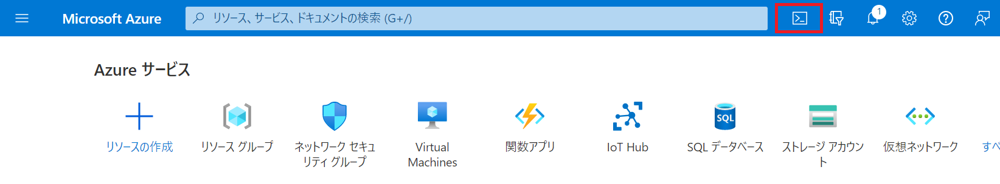
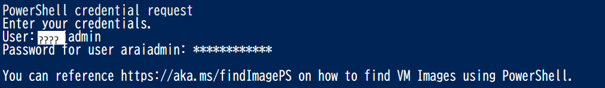
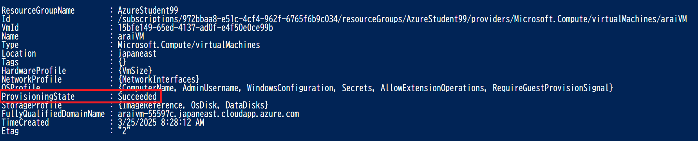
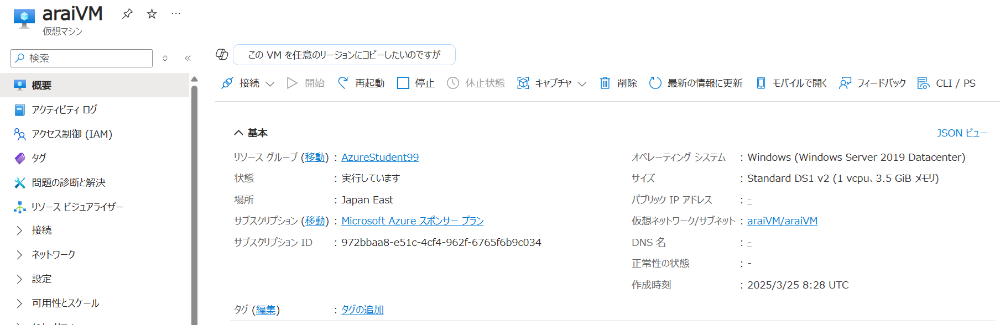

---
wts:
    title: 'PowerShell を使用してVMを作成する (10 分)'
---
# PowerShell を使用してVM を作成する (10 分)

このチュートリアルでは、Cloud Shell を構成し、Azure PowerShell モジュールを使用してリソース グループとVMを作成します。

# タスク 1: Cloud Shell を設定する 

このタスクでは、Cloud Shell を構成します。 

1. [Azure portal](https://portal.azure.com) にサインインします。 

2. Azure portal から、右上にあるアイコンをクリックして、**Azure Cloud Shell** を開きます。

    

3. **Bash** や **PowerShell** のどちらかを選択するためのプロンプトが表示されたら、**PowerShell** を選択します。

    > **注**: **Cloud Shell** の初回起動時に **「ストレージがマウントされていません」** というメッセージが表示された場合は、このラボで使用しているサブスクリプションを選択し、**「ストレージの作成」** を選択します。

4. メッセージが表示されたら、**「ストレージの作成」** をクリックし、「Azure Cloud Shell」 ウィンドウが表示されるまで待ちます。

# タスク 2: VMを作成する

このタスクでは、PowerShell を使用して、リソース グループとWebAppを作成します。  

1. Cloud Shell ペインの左上のドロップダウン メニューで、**「PowerShell」** が選択されていることを確認します。

2. Powershell ウィンドウで次のコマンドを実行して、現在のリソース グループを一覧表示し確認します。

    ```PowerShell
    Get-AzResourceGroup
    ```

3. 次のコマンドをメモ帳などで編集し、ターミナル ウィンドウに貼り付けて、WebAppを作成します。 

    > **注**:「????」に入る値は**ご自身の苗字をアルファベット**に変更してください。

    ```PowerShell
    New-AzVM `
    -ResourceGroupName "AzureStudent????" `
    -Name "????VM" `
    -Location "japaneast" `
    -Image "MicrosoftWindowsServer:WindowsServer:2019-Datacenter:17763.5122.231109" `
    -Size "Standard_DS1_v2" `
    -Credential (Get-Credential)
    ```

4. 「**管理者アカウント**」を入力します。

    

    | 設定       | 値               |
    | ---------- | ---------------- |
    | ユーザー名 | **????admin**    |
    | パスワード | **Pa55w.rd1234** |

    ※????は苗字を入れてください。

5. VMが作成されたら、ProvisioningStateがSucceededだったらVMが正常に作成されたことが確認できます。

    

6. PowerShell セッションの CloudShell ペインを最小化します。

7. Azure portal で「**Virtual Machines**」を検索し、作成したVMを確認してください。

     

# タスク 3: Cloud Shell でVMを操作する

このタスクでは、Cloud Shell から PowerShell コマンドを実行する練習を行います。 

1. Azure portal から、右上にあるアイコンをクリックして **Azure Cloud Shell** を開きます。

2. Cloud Shell ペインの左上のドロップダウン メニューで、**「PowerShell」** が選択されていることを確認します。

3. 名前、リソース グループ、場所、状態など、WebAppに関する情報を取得します。

    ```PowerShell
    Get-????VM
    ```

4. 次のコマンドを使用してWebAppを停止します。 

    > **注**:「ctc**xxxx**」に入る値は**ご自身のユーザー名の番号**に変更してください。
    
    > **注**:「**yyyymmdd**」に入る値は**今日の日にち**に変更してください。
    
    ```PowerShell
    Stop-????VM -ResourceGroupName myRGPS -Name ctcxxxxyyyymmdd
    ```
    
5. 実行結果のState項目が「**Stopped**」に変更されたことを確認してください。

6. WebAppのWebページをもう一度確認し、停止されたことを確認してください。

    > **注**:Webページでは「Error 403 - This VM is stopped.」と表示されます。
    
6. 次のコマンドを実行して、作成したリソースグループとリソースを削除してください。

    > 注:自動的に削除されます。確認する場合はAzure Portal上で確認してください。
    
    ```PowerShell
    Get-AzVM -ResourceGroupName "AzureStudent????" -Name "????VM"
    ```
    
    

このラボでは次の内容を学習しました。

- Cloud ShellのPowerShellを使用してVMを作成しました。
- Cloud ShellのPowerShellを使用してVMを停止しました。
- Cloud ShellのPowerShellを使用してVMを削除しました。
